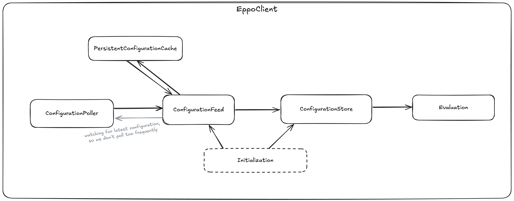

# Configuration Lifecycle

This document explains how configuration is managed throughout its lifecycle in the Eppo SDK.

## Components Overview

The SDK's configuration management is built around several key components that work together:

- **ConfigurationFeed**: A broadcast channel that serves as the central communication point between components
- **ConfigurationStore**: Maintains the currently active configuration used for all evaluations
- **ConfigurationPoller**: Periodically fetches new configurations from the Eppo API
- **PersistentConfigurationCache**: Persists configuration between application restarts

## Communication Flow

The ConfigurationFeed acts as a central hub through which different components communicate:

When a new configuration is received (either from network or cache), it's broadcast through the ConfigurationFeed. Components subscribe to this feed to react to configuration changes. Importantly, configurations broadcast on the ConfigurationFeed are not necessarily activated - they may never be activated at all, as they represent only the latest discovered configurations. For components interested in the currently active configuration, the ConfigurationStore provides its own broadcast channel that only emits when configurations become active.

## Initialization Process

During initialization, the client:

1. **Configuration Loading Strategy**:
   - `stale-while-revalidate`: Uses cached config if within `maxStaleSeconds`, while fetching fresh data
   - `only-if-cached`: Uses cached config without network requests
   - `no-cache`: Always fetches fresh configuration
   - `none`: Uses only initial configuration without loading/fetching

2. **Loading cached configuration**:
   - If `initialConfiguration` is provided, uses it immediately
   - Otherwise, tries to load cached configuration

3. **Network Fetching**:
   - If fetching is needed, attempts to fetch until success or timeout
   - Applies backoff with jitter between retry attempts (with shorter period than normal polling)
   - Broadcasts fetched configuration via ConfigurationFeed

4. **Completion**:
   - Initialization completes when either:
     - Fresh configuration is fetched (for network strategies)
     - Cache is loaded (for cache-only strategies)
     - Timeout is reached (using best available configuration)

## Ongoing Configuration Management

After initialization:

1. **Polling** (if enabled):
   - ConfigurationPoller periodically fetches new configurations
   - Uses exponential backoff with jitter for retries on failure
   - Broadcasts new configurations through ConfigurationFeed

2. **Configuration Activation**:
   - When ConfigurationStore receives new configurations, it activates them based on strategy:
     - `always`: Activate immediately
     - `stale`: Activate if current config exceeds `maxStaleSeconds`
     - `empty`: Activate if current config is empty
     - `next-load`: Store for next initialization

3. **Persistent Storage**:
   - PersistentConfigurationCache listens to ConfigurationFeed
   - Automatically stores new configurations to persistent storage
   - Provides cached configurations on initialization

## Evaluation

For all feature flag evaluations, EppoClient always uses the currently active configuration from ConfigurationStore. This ensures consistent behavior even as configurations are updated in the background.
